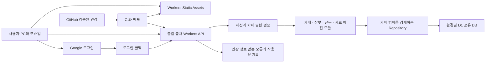
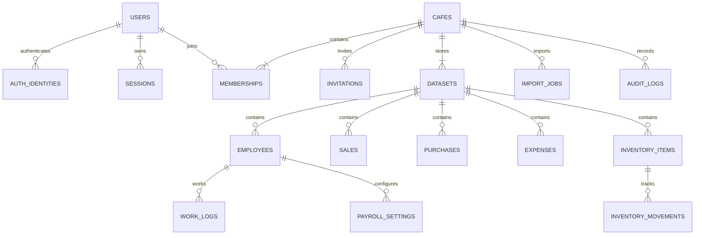
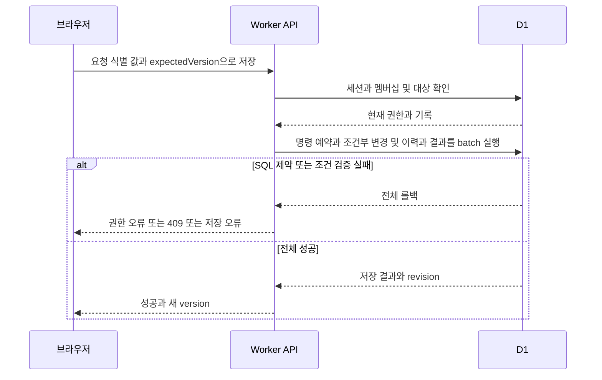
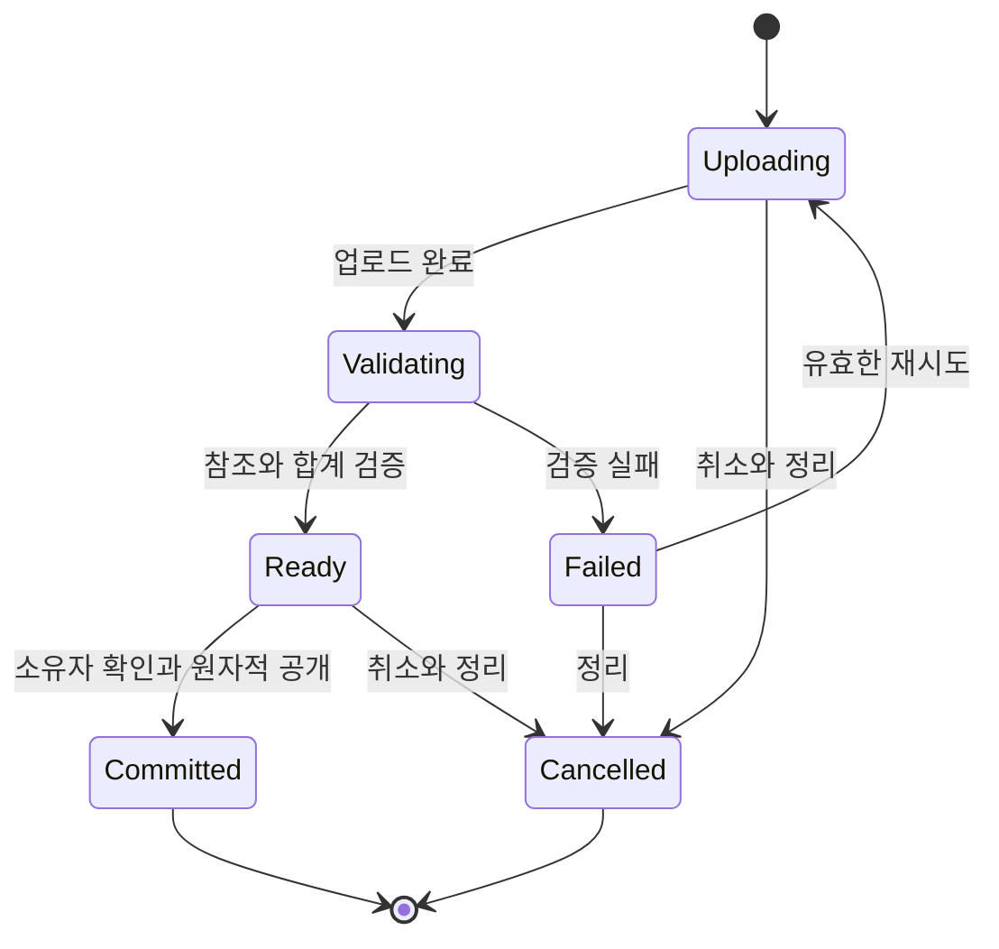

# Cafe Admin 아키텍처 설계서

- 버전: 0.1
- 작성일: 2026-10-08
- 상태: 구현 전 기술 설계안
- 기준 커밋: `17ce1df1b72793be63f423f5667f431d6eb3e3af`
- 기준 문서: [PRD](https://github.com/a01094864335-cell/cafe-admin/blob/main/docs/PRD.md), [작업 계획서](https://github.com/a01094864335-cell/cafe-admin/blob/main/docs/WORK_PLAN.md), [IA](https://github.com/a01094864335-cell/cafe-admin/blob/main/docs/IA.md), [사용자 플로우](https://github.com/a01094864335-cell/cafe-admin/blob/main/docs/USER_FLOWS.md)

## 1 설계 결론

**하나의 웹 애플리케이션, 하나의 Workers API, 환경별 공유 D1 DB**로 시작한다. 사용자와 카페는 멤버십으로 N:N 연결하고, 서버의 공통 권한 검사와 카페 범위를 강제하는 데이터 접근 계층으로 격리한다.

프런트엔드는 기존 HTML 화면과 계산을 단계적으로 모듈화한다. 서버는 도메인별 모듈을 분리하되 하나의 배포 단위로 운영한다. 서버 간 통신, 메시지 큐, 실시간 소켓, 외부 캐시 없이 초기 카페 10개·가입자 50명·동시 접속 10명 가정을 검증한다.

이 문서는 실행할 수 있는 전체 스키마나 구현 완료 보고서가 아니다. 데이터 제약과 트랜잭션 설계를 먼저 테스트 환경에서 검증하고, 작업 계획서 순서대로 구현한다. 제품 범위는 PRD가 우선하며 새 운영 수치·정책은 제안으로 구분한다.

## 2 시스템 구성



| 구성 | 책임 | 경계 |
| --- | --- | --- |
| 정적 화면 | 화면·입력·상태 관리, API 호출 | 권한과 장부의 최종 판단은 서버가 수행 |
| Workers | 라우팅·인증·인가·입력 검증·업무 처리 | DB는 서버 바인딩으로만 접근 |
| D1 | 관계·제약·거래·이력·세션·작업 상태 | 실제 매장 기록의 기준 저장소 |
| Google OIDC | 사용자 신원 확인 | 카페 권한은 Google 토큰에 저장하지 않음 |
| GitHub와 CI | 소스 검증·빌드·배포 | 사용자 장부·백업·비밀 키는 저장하지 않음 |

### 기술 선택

- 프런트엔드: TypeScript와 Vite로 기존 DOM·CSS·계산 코드를 모듈화한다. MVP에서는 대규모 UI 재작성이나 프레임워크 교체를 선행하지 않는다.
- 백엔드: TypeScript 기반 Workers Fetch 핸들러, 도메인 서비스, 명시적인 입력 스키마와 응답 타입.
- 데이터 접근: D1 prepared statement와 버전 관리 SQL migration. 원시 SQL은 Repository 내부로 제한한다.
- 계산: 날짜·금액·근무 계산을 순수 함수로 분리한다. 서버 계산이 기준이고 화면 계산은 미리보기에 사용한다.
- 정적 파일은 자산 경로에서 제공한다. `/api/*`, `/auth/*`는 Worker가 먼저 처리하며, 존재하지 않는 API는 HTML 대신 JSON 404를 반환한다.

Worker 우선 경로와 자산 fallback은 공식 설정을 따라 검증한다. 로그인 화면을 포함한 정적 앱 셸은 공개되어도 되지만, 장부를 정적 HTML에 포함하지 않는다. [Workers 라우팅](https://developers.cloudflare.com/workers/static-assets/routing/worker-script/)

## 3 모듈과 의존 방향

```text
src/
  client/
    app/                 라우팅과 카페 전환
    features/            IA 화면별 UI
    api/                 요청, 오류, 요청 식별 값
    state/               메모리 상태와 미저장 입력
  server/
    routes/              HTTP 입출력
    middleware/          세션, 권한, CSRF, 요청 크기
    services/            업무 규칙과 원자적 명령
    repositories/        카페 범위 SQL과 D1 batch
    auth/                OIDC와 세션
    jobs/                가져오기와 정리 작업
  shared/
    contracts/           입력 스키마와 응답 타입
    calculations/        금액과 근무 계산
migrations/              순서가 있는 SQL 변경
tests/                   단위·통합·브라우저 검증
docs/                    제품과 기술 문서
```

의존 방향은 Route → Service → Repository → D1이다. UI가 SQL이나 Cloudflare 비밀 설정을 알지 않게 한다. 서비스 간 공유는 명시적인 함수 호출로 제한하고, 전역 변수에 현재 카페·로그인 사용자를 보관하지 않는다.

검증된 요청 컨텍스트는 `userId`, `sessionId`, `cafeId`, `membershipId`, `role`을 담는다. 클라이언트가 보낸 역할·작성자 값은 신뢰하지 않는다. 카페 범위 Repository는 이 컨텍스트를 필수 인자로 받는다.

## 4 데이터 모델



ERD는 핵심 관계를 보여주는 논리 모델이다. `datasets`는 자료 이전을 완료하기 전 데이터를 공개하지 않기 위한 저장 단위다. 사용자에게 별도 제품 개념으로 노출하지 않는다.

### 4.1 공통 규칙

- ID는 서버가 생성한다. 거래·직원·품목에는 `cafe_id`, `dataset_id`, `id`를 둔다.
- 시간은 UTC timestamp, 영업 날짜는 별도 `business_date`로 저장한다. 카페의 IANA 시간대로 조회 범위를 계산한다.
- 금액은 원 단위 정수이며 JSON·DB 입력 시 안전한 정수 범위를 검사한다. 수량은 정해진 소수 자릿수의 정수 스케일과 단위를 함께 저장한다.
- 변경 가능한 기록에 `version`, `created_at`, `updated_at`, 작성자·수정자를 둔다.
- 장부 삭제는 `deleted_at`을 둔 논리 삭제로 시작한다. 재고 영향은 반대 이동 또는 차이 이동을 같은 트랜잭션에서 기록한다.
- 참조 키는 `(cafe_id, dataset_id, target_id)` 전체를 검증한다. ID 하나만 맞는 다른 카페·다른 데이터 세트의 참조는 거부한다.
- 계정·멤버십은 dataset에 속하지 않는다. 장부 가져오기로 소유권·로그인 계정을 덮어쓰지 않는다.

### 4.2 테이블과 제약

| 테이블 | 주요 키와 속성 | 필수 제약 |
| --- | --- | --- |
| users | id, name, email | 이메일은 표시·초대 확인용이며 로그인 식별 키 아님 |
| auth_identities | provider, subject, user_id | `UNIQUE(provider, subject)` |
| sessions | token_hash, user_id, expires_at, revoked_at | 토큰 원문 미저장, 만료·폐기 검사 |
| oauth_transactions | state_hash, nonce, verifier, expires_at | 짧은 만료, 일회용, 브라우저 흐름에 연결 |
| cafes | id, name, timezone, active_dataset_id, write_mode, revision | active_dataset은 같은 카페 소속, 생성 batch 안에서만 초기 미지정 허용, 완료 시 필수 |
| memberships | id, cafe_id, user_id, role, status, version | `UNIQUE(cafe_id, user_id)`, role은 owner/admin/staff |
| invitations | token_hash, cafe_id, email, role, inviter_id, expires_at, consumed_by | 역할은 admin/staff, 토큰 unique, 상태 전이 검사 |
| datasets | id, cafe_id, state | `UNIQUE(cafe_id, id)`, state는 staging/active/retired |
| employees | cafe_id, dataset_id, id, linked_user_id | 계정 연결은 선택 사항, 같은 카페·dataset에서 연결 사용자 중복 금지 |
| sales/purchases/expenses | 범위 키, 날짜, 금액, 분류, version | 금액·날짜 검증, 범위별 식별 키 unique |
| inventory_items | 범위 키, 단위, 수량 스케일 | 재고 수량은 이동으로 설명 가능해야 함 |
| inventory_movements | 범위 키, item_id, delta, source_id, operation_id | 참조 품목 동일 범위, 중복 작업 이동 차단 |
| work_logs | 범위 키, employee_id, 출퇴근, 휴게, version | 본인 연결 검사, 종료·휴게 시간 유효성 |
| payroll_settings | 범위 키, employee_id, effective_from, 계산 설정 | 적용 기간과 기존 계산 규칙 명시 |
| commands | id, user_id, scope, key, payload_hash, result, created_at | `UNIQUE(user_id, scope, key)`, 중복 요청 처리 |
| import_jobs/import_chunks | cafe_id, dataset_id, file_hash, chunk_no, state | 카페별 실행 작업 1개, 작업 내 chunk 번호 unique |
| export_jobs | cafe_id, dataset_id, revision, owner_id, expires_at, state | 실행 중 쓰기 잠금, 페이지마다 권한·만료 재검증 |
| transaction_assertions | id, ok | 내부 전용 CHECK 제약, 동일 batch에서 생성·정리 |
| audit_logs | cafe_id, actor_id, operation_id, target, action, 변화 요약 | 변경 명령과 함께 저장, 일반 API에서 수정 불가 |

목록 인덱스는 `(cafe_id, dataset_id, business_date, id)`, 근무는 여기에 `employee_id`, 감사 이력은 `(cafe_id, created_at, id)`를 사용한다. 활성 멤버십 조회와 세션 토큰 조회에도 인덱스를 둔다. 외래 키는 명시적으로 정의하고 마이그레이션·샘플 데이터로 위반 사례를 검증한다. [D1 외래 키](https://developers.cloudflare.com/d1/sql-api/foreign-keys/)

업무 변경과 멤버십 변경은 카페 revision을 함께 증가시킨다. 직원용 변경 확인 응답에는 변경 존재 여부만 제공하고 거래·급여 값이나 대상 정보를 포함하지 않는다.

### 4.3 소유자 1명 보장

활성 owner에 대한 카페별 부분 unique 인덱스로 소유자 중복을 막는다. 이는 소유자 0명을 막지는 못하므로 다음도 필요하다.

- 카페 생성은 카페·초기 dataset·owner 멤버십을 하나의 batch로 만든다.
- 소유권 이전은 현재 소유자와 대상 활성 멤버를 검증한 뒤 기존 owner를 admin으로 변경하고 대상을 owner로 변경한다.
- 마지막 SQL 검증에서 활성 owner 수가 정확히 1이 아니면 batch 전체를 실패시킨다.
- 일반 역할 변경·참여 해제 경로는 owner를 대상으로 받지 않는다.

기존 소유자를 admin으로 바꾸는 것은 사용자 플로우 F09의 제안을 기술적으로 적용한 기본안이며, W02에서 제품 정책으로 확정해야 한다.

## 5 인증과 카페별 권한

### 5.1 로그인

Google OIDC authorization-code 흐름을 사용한다. 서버는 `state`, `nonce`, PKCE와 정확한 callback URI를 검증하며 검증된 라이브러리로 토큰 서명·issuer·audience·만료·nonce를 검사한다. 필요한 scope는 `openid email profile`로 제한한다. 신원 키는 Google `sub`이며 이메일 자동 연결로 다른 계정을 합치지 않는다. [Google OIDC](https://developers.google.com/identity/openid-connect/openid-connect)

로그인 성공 시 무작위 세션 토큰을 발급하고 D1에는 해시만 저장한다. 세션 쿠키는 `__Host-session`, `Secure`, `HttpOnly`, `SameSite=Lax`, `Path=/`를 사용한다. 세션은 7일 절대 만료를 초기 제안으로 두고 로그아웃 시 폐기한다. OAuth 임시 기록은 10분 만료 제안이다. Google 토큰은 브라우저 저장소에 보관하지 않는다.

변경 요청은 허용된 Origin과 CSRF 토큰을 확인한다. OAuth callback은 일반 변경 API와 분리된 state 검증을 사용한다. Google 로그인에 성공했어도 카페 생성 허용 목록에 없으면 카페를 생성할 수 없다.

### 5.2 권한 검사

1. 세션 유효성 확인.
2. 카페와 활성 멤버십 조회.
3. 요청 작업에 필요한 역할 확인.
4. 대상 기록·직원·품목이 해당 카페와 활성 dataset에 속하는지 확인.
5. 본인 근무 요청은 서버에서 계정에 연결된 employee를 결정.
6. 쓰기 SQL에도 활성 멤버십과 역할·dataset·잠금 조건을 넣어 사전 검사 이후의 권한 변경을 방어.

멤버십은 요청마다 조회하고 역할을 세션이나 장기 캐시에 고정하지 않는다. 권한 변경이 완료된 뒤 시작하는 요청은 새 권한을 따른다. 이미 실행 중인 요청은 DB 실행 순서에 따라 처리되므로 UI만으로 즉시 취소를 보장하지 않는다.

직원 응답 DTO에는 전체 손익·급여 필드를 만들지 않는다. 내보내기·가져오기·소유권 이전은 owner 전용이다. 초대 수락 시 대상 이메일 검증뿐 아니라 초대자의 현재 부여 권한도 다시 확인한다.

## 6 쓰기 일관성과 D1 트랜잭션

D1의 `batch()`는 여러 prepared statement를 묶고 SQL 오류가 발생하면 전체를 롤백한다. 여러 개의 독립 `run()` 호출을 트랜잭션처럼 사용하지 않는다. 또한 조건부 UPDATE의 영향 행 수 0은 SQL 오류가 아니므로 batch가 자동 실패한다고 가정하지 않는다. [D1 batch](https://developers.cloudflare.com/d1/worker-api/d1-database/)

### 명령 처리 단위



batch 구성은 다음 순서를 따른다.

1. 같은 사용자·범위·요청 키의 command를 unique 제약으로 예약한다.
2. 현재 권한·활성 dataset·쓰기 잠금·expectedVersion을 SQL 안에서 재검증한다.
3. 거래, 관련 재고 이동, 필요한 수량 반영을 수행한다.
4. 영향 행 수·필수 참조·소유자 수 등 후조건을 검사한다.
5. 감사 이력과 카페 revision, 재전송용 최소 결과를 저장한다.

조건 실패를 확실히 SQL 오류로 바꾸는 내부 assertion을 설계한다. 예를 들어 `CHECK(ok = 1)`이 있는 내부 검증 테이블에 계산된 0/1 값을 넣고 성공 행은 같은 batch에서 삭제한다. `changes()`에 의존하는 검사는 해당 변경 바로 다음에 배치한다. 이 메커니즘은 사용자 입력 SQL을 받지 않으며, W04에서 실제 D1 동작과 롤백을 검증한 후 공통 Repository 함수로 고정한다.

### 낙관적 잠금

갱신 조건은 `cafe_id + dataset_id + id + version + deleted_at IS NULL`이다. 성공 시 version을 1 올린다. 0건 변경은 후조건 검사로 전체 명령을 롤백한 뒤, 새 권한 검사를 거쳐 404·403·409를 구분한다. 409에는 해당 사용자가 볼 수 있는 최신 기록만 포함한다.

### 중복 요청

- 생성·수정·삭제·초대 수락·가져오기 상태 변경에 `Idempotency-Key`를 사용한다.
- 키 범위는 사용자 + 카페 또는 계정 범위 + HTTP 작업이다. 본문 해시는 정규화된 입력을 기준으로 계산한다.
- 같은 키·같은 입력은 저장된 최소 결과를 재사용한다. 같은 키·다른 입력은 `409 IDEMPOTENCY_MISMATCH`다.
- 동시 요청의 unique 충돌은 실패 요청을 롤백한 뒤 기존 command 결과를 조회한다. 재전송에도 현재 권한을 먼저 검증한다.
- MVP 파일럿 중 command는 임의로 만료·삭제하지 않는다. 저장량을 측정한 후 보존 기간과 만료 후 재전송 계약을 별도 결정한다.

## 7 API 계약 개요

카페 API prefix는 `/api/v1/cafes/:cafeId`다. 아래 표의 O/A/S는 owner/admin/staff다. 서버는 메뉴 노출 여부와 관계없이 동일한 권한을 검사한다.

| 경로와 메서드 | 기능 | 권한 |
| --- | --- | --- |
| `GET /auth/google/start`, `GET /auth/google/callback` | 로그인과 callback | 로그인 흐름 |
| `GET /api/v1/me`, `POST /auth/logout` | 세션 확인·종료 | 로그인 |
| `GET /api/v1/cafes`, `POST /api/v1/cafes` | 참여 목록·생성 | 로그인, 생성은 허용 대상 |
| `GET /api/v1/invitations/:token`, `POST .../:token/accept` | 초대 확인·수락 | 대상 계정, 상태에 맞는 최소 정보 |
| `GET/PATCH /api/v1/cafes/:cafeId` | 매장 정보·설정 | GET은 멤버, PATCH는 O |
| `GET /members`, `POST /invitations` | 멤버와 초대 | O/A, A는 직원 초대만 |
| `PATCH/DELETE /members/:userId`, `DELETE /invitations/:id` | 역할·참여·초대 관리 | 대상별 O/A 제한 |
| `POST /ownership-transfer` | 소유권 이전 | O |
| `GET/POST /sales`, `/purchases`, `/expenses` | 거래 목록·등록 | O/A |
| `GET/PATCH/DELETE /sales/:id` 등 | 거래 상세·변경·삭제 | O/A |
| `GET/POST /inventory/items`, `PATCH/DELETE /inventory/items/:id` | 품목 관리 | O/A, 참조 기록 보존 |
| `GET/POST /inventory/movements` | 이동 조회·조정 | O/A, 기존 이동은 직접 덮어쓰지 않음 |
| `GET/POST /employees`, `PATCH /employees/:id` | 직원·계정 연결 | O/A |
| `GET/POST /work-logs`, `PATCH/DELETE /work-logs/:id` | 전체 근무 관리 | O/A |
| `GET/POST /my/work-logs` | 본인 근무 조회·입력 | O/A/S, 서버가 직원 결정 |
| `GET/PATCH /employees/:id/payroll-settings`, `GET /payroll` | 급여 설정·계산 | O/A |
| `GET /dashboard`, `GET /changes?since=` | 집계·변경 확인 | O/A, 직원은 허용된 변경 알림만 |
| `POST /imports`, `PUT /imports/:id/chunks/:no` | 작업·자료 업로드 | O |
| `POST /imports/:id/validate`, `/commit`, `/cancel`, `GET /imports/:id` | 검증·공개·정리·상태 | O |
| `POST /exports`, `GET /exports/:id`, `GET /exports/:id/pages` | 일관된 백업 내보내기 | O |
| `GET /audit-logs` | 변경 이력 | O/A |

목록은 기본 50건·최대 100건, 날짜 필터와 `(date, id)` 커서를 사용한다. 오류 형식은 `{ error: { code, message, requestId, fields? } }`, 성공은 `{ data, meta: { revision?, nextCursor? } }`로 통일한다. 이는 초기 API 제안이며 W02에서 상세 스키마로 확정한다.

| HTTP | 의미 |
| --- | --- |
| 400/422 | 요청 구조·필드 검증 실패 |
| 401 | 로그인 필요·세션 만료 |
| 403 | 멤버이지만 해당 작업 권한 없음 |
| 404 | 비참여 카페 또는 접근 범위 밖의 기록, 존재 여부 최소 공개 |
| 409 | 버전 충돌·중복 키 입력 불일치·가져오기/내보내기 잠금 |
| 413 | 크기 제한 초과 |
| 429 | 앱 요청 제한, 재시도 지연 안내 |
| 503 | 일시 장애·무료 한도 부족, 저장 성공으로 표시하지 않음 |

초대 토큰은 URL·오류·분석 로그에서 제거한다. 카페 API는 `Cache-Control: no-store`를 적용하고 개인정보 응답을 CDN 캐시에 넣지 않는다.

## 8 대량 JSON 이전과 공개 시점

기존 JSON 전체를 하나의 행으로 저장하거나 하나의 요청에서 끝내지 않는다. 브라우저가 파일을 파싱하고 작은 chunk로 나누되, 서버가 각 chunk의 형식·금액·참조·순서를 다시 검증한다.

초기 제안은 파일 5MB·합계 10,000레코드 이하, 요청 payload 64KiB 이하로 제한한다. batch 내 문장 수와 각 SQL의 바인딩 수를 제한하고, CPU 측정 결과에 따라 더 줄인다. 이는 Cloudflare의 제품 한도가 아니라 앱의 파일럿 제한이다. 범위를 넘는 파일은 부분 반영 없이 안내한다.



1. 작업 생성 batch가 소유자·빈 장부·실행 중 작업 없음 조건을 확인하고 카페를 importing 상태로 잠근다. 원래 활성 dataset은 유지한다.
2. 새 staging dataset을 만든다. 모든 chunk는 `(job_id, chunk_no)`와 해시로 중복 확인한다.
3. 정상 조회는 반드시 `cafes.active_dataset_id`에 제한한다. staging에는 집계·내보내기·직원 조회로도 접근할 수 없다.
4. 서버가 카운트·금액 합계·참조 무결성을 chunk별로 검증하고 완료한 버전을 고정한다. Ready 이후 chunk 수정은 차단한다.
5. 최종 commit batch가 소유자·작업 상태·현재 dataset·잠금을 재검증하고 active_dataset 포인터 교체, 상태 전환, 감사 기록, revision 갱신과 잠금 해제를 함께 처리한다.
6. 응답 유실 시 job 상태를 조회한다. 브라우저 종료 시 작업은 멈추며 재접속 후 이어간다. 요청 종료 후 백그라운드 코드가 끝까지 실행된다고 가정하지 않는다.
7. 취소는 작업을 더 이상 쓸 수 없게 만든 후 잠금을 해제한다. 숨겨진 staging 데이터는 작은 batch로 정리한다. 활성 dataset은 삭제 대상이 될 수 없다.

카페 잠금은 본인 근무를 포함한 모든 업무 쓰기에 적용한다. 권한 회수는 계속 가능하며, 소유권 이전은 실행 중 작업을 취소·정리한 뒤 허용한다. 오래 멈춘 작업은 소유자가 다시 열어 이어가거나 취소한다. MVP에서는 정기 큐가 필요하지 않다.

D1 Free는 DB당 500MB, 계정 총 5GB이며 바인딩·쿼리 수 등의 제약도 있으므로 upload·검증·정리 단계를 작은 명령으로 나눈다. [D1 제한](https://developers.cloudflare.com/d1/platform/limits/)

## 9 내보내기와 복구

페이지를 나누어 다운로드하는 동안 장부가 바뀌면 서로 다른 시점의 백업이 된다. MVP 내보내기는 짧은 **카페별 업무 쓰기 잠금**을 잡고 dataset·revision을 고정한다. 읽기는 계속 허용한다. export 작업별 고정된 목록을 순서대로 내려받아 브라우저에서 버전·건수·합계를 포함한 JSON을 조립한다.

잠금은 초기 제안 5분, 상태 조회 시 갱신하며 만료·취소 시 해제한다. 만료되면 진행 중 백업은 실패로 처리하고 처음부터 다시 시작한다. 모든 페이지 요청과 최종 완료 시 잠금·revision·소유자 권한을 검사한다. 다운로드 요청과 사용자의 실제 파일 보관은 구분한다. 큰 데이터에서 업무 중단이 길어지면 버전 스냅샷 방식으로 확장한다.

카페 JSON은 업무 데이터 이전·수동 백업용이다. Google 로그인 정보, 세션, 초대 토큰, 모든 감사 이력을 포함하는 전체 재해 복구 백업은 아니다. 새 카페로 복원할 때 계정 연결은 재확인한다.

전체 복구는 D1 시점 복구와 별도 보관한 검증된 export를 활용한다. Free 시점 복구 기간은 7일이다. 복구 후에는 세션·초대의 과거 상태가 되살아날 수 있으므로 세션과 초대 폐기, 멤버십 변경 재검토를 필수 절차로 둔다. [D1 Time Travel](https://developers.cloudflare.com/d1/reference/time-travel/)

개별 카페 복구는 복구용 환경에서 원본 데이터를 추출·검증하고 해당 카페만 반영한다. 다른 카페가 포함된 운영 DB 전체를 덮어쓰지 않는다. 복구 시간 목표는 초기 4시간, 일일 수동 백업 기준 손실 허용 목표는 24시간으로 제안하며 실제 복구 연습 후 확정한다.

## 10 프런트엔드 상태와 보안

- UI 캐시 키에 사용자·카페·리소스·필터를 포함한다. 카페 전환은 이전 요청 취소와 응답 세대 번호 검사로 보호한다.
- 장부 데이터·세션 토큰을 localStorage에 저장하지 않는다. 테마와 마지막 선택 카페 같은 비민감 설정만 저장한다.
- 저장 성공 전 목록과 합계를 확정하지 않는다. 응답 유실은 같은 요청 키로 결과를 확인한다.
- 활성 탭은 60초 주기로 경량 변경 조회를 하고 변경이 있을 때 필요한 데이터만 읽는다. 편집 폼은 자동 교체하지 않는다.
- 역할 회수·로그아웃 시 메모리 상태를 비운다. 이미 화면을 본 사용자의 기억·다운로드까지 회수할 수 있다고 표현하지 않는다.
- 기존 `innerHTML` 경로를 점검하고 사용자 입력은 textContent 또는 명시적 안전한 렌더링으로 처리한다. 스크립트를 모듈 파일로 분리해 CSP 적용을 준비한다.
- 로그인·초대 수락·가져오기에는 요청 제한을 적용한다. Worker 전역 메모리 카운터를 계정 전체 제한으로 취급하지 않는다. 파일럿용 D1 시간 구간 카운터의 비용을 측정한다.
- API·직원·급여 오류 로그는 원문 대신 요청 ID·오류 코드·시간을 남긴다. 비밀 키·세션·초대 링크를 GitHub나 분석 이벤트에 넣지 않는다.

## 11 배포와 운영

| 환경 | 데이터 | 로그인 설정 | 배포 정책 |
| --- | --- | --- | --- |
| 로컬 | 로컬 D1 테스트 자료 | 로컬용 설정 | 실제 장부 사용 금지 |
| 테스트 | 별도 원격 D1 | 테스트 callback | PR 검증과 통합 테스트 |
| 운영 | 운영 D1 | 운영 callback | 검증된 커밋을 명시적으로 배포 |

CI는 타입·빌드·계산 테스트, 권한·D1 통합 테스트를 실행한다. 운영 migration은 환경을 명시하고 순차 실행한다. 비밀 값은 환경별 비밀 저장소에 두며 PR·미리보기에서 운영 자격 증명에 접근하지 못하게 한다.

스키마는 새 열·테이블 추가 → 양쪽 코드와 호환되는 배포 → 자료 이전 → 후속 정리 순서로 변경한다. 코드 되돌리기가 DB 스키마를 자동 복원하지 않는다. 파괴적 migration은 별도 백업·복구 검증 후 수행한다.

관측 항목은 오류율, p95 응답, Worker CPU, API 요청 수, D1 읽기·쓰기 행 수, DB 크기, 미완료 import/export다. 초기 운영자는 매일 확인하고 70% 한도에서 최적화, 85%에서 확대 중단 또는 유료 전환을 검토한다.

예를 들어 동시 접속 10명이 8시간 동안 60초마다 조회하면 경량 갱신 요청은 약 4,800회/일이다. 이는 로그인·장부 요청·DB 쿼리를 제외한 산술 예시로, 무료 운영 보장이 아니다. Workers Free의 일 100,000 요청·요청당 CPU 10ms를 실제 OAuth·검증·집계·업로드에서 측정한다. [Workers 요금](https://developers.cloudflare.com/workers/platform/pricing/)

## 12 설계 선택과 확장 조건

| 선택 | 이유 | 재검토 조건 |
| --- | --- | --- |
| 단일 Worker 배포 | 인증·거래 경계와 운영 단순화 | 모듈별 독립 확장이 실측으로 필요할 때 |
| 공유 DB와 cafe_id | N:N 조회와 초기 관리 용이 | 테넌트별 격리·복구 요구, 용량·부하 한계 |
| 명시적 SQL | 조건부 쓰기·batch 동작을 직접 검증 | ORM 도입으로 얻는 유지보수 이익이 명확할 때 |
| 서버 세션 | 권한 회수·로그아웃 처리 단순화 | 세션 조회 비용이 주요 병목일 때 |
| 60초 갱신 | 실시간 연결 운영 비용 회피 | 실제 업무에서 반영 지연이 문제일 때 |
| dataset 포인터 공개 | 대량 가져오기 원자적 공개 | 부분 병합·지점 간 이동이 범위에 추가될 때 |
| primary DB 경로 | 권한·저장 후 읽기의 일관성 단순화 | 읽기 복제 도입 시 세션 일관성 별도 설계 |

무료 한계를 넘으면 먼저 쿼리·갱신 빈도·보관량을 개선한다. 이후 유료 Workers/D1 또는 다른 DB를 검토한다. 카페별 DB 분리·PostgreSQL 전환은 초기 필수 작업이 아니다. D1은 애플리케이션의 테넌트 검증이 핵심 방어선이므로 자동 행 수준 권한이 있다고 가정하지 않는다.

## 13 구현 검증과 작업 연결

| 검증 | 반드시 확인할 실패 사례 | 작업 계획 연결 |
| --- | --- | --- |
| D1 원자성 | 0행 갱신, 마지막 assertion 실패, 재고 쓰기 실패 시 전체 롤백 | W04·W09·W11 |
| 카페 격리 | 모든 API에 타 카페 ID·타 dataset ID·타 직원 ID 주입 | W06·W08–W12, T02·T03 |
| 소유권 | 동시 이전·탈퇴·관리자 승격 경쟁에도 owner 정확히 1명 | W07, T05 |
| 초대 | 만료·취소·중복 수락·초대자 권한 회수 | W07, T04 |
| 중복 요청 | 동일 키 동시 요청, 같은 키 다른 입력, 응답 유실 후 재시도 | W11, T07 |
| 가져오기 | 검증 후 변경, commit 응답 유실, 취소와 chunk 쓰기 경쟁 | W12, T10 |
| 내보내기 | 잠금 만료·다중 페이지 중 권한 회수·동시 수정 | W12·W14 |
| 복구 | 과거 세션 재활성화 방지, 개별 카페 복구 시 타 카페 보존 | W14, T11 |
| 성능 | 10명 동시 접근의 조회·저장 p95와 CPU·스캔 행 수 | W15, T12 |

첫 PR에서는 기존 동작 분석과 코드 분리를 수행한다. 다음 PR에서 **D1 batch 실패 전파·카페 범위 참조·owner 제약·dataset 공개**를 작은 테스트로 검증한 뒤 로그인과 매출 공유를 연결한다. 복잡한 데이터 처리를 화면 구현 뒤로 미루지 않는다.

## 14 착수 시 확정할 제품 정책

아키텍처를 작성하기 위해 사용한 다음 기본안은 W02에서 확정한다.

- 기존 소유자는 소유권 이전 후 관리자로 전환.
- 직원 계정 연결은 카페별 한 명의 직원 기록에만 허용.
- 세션 7일, OAuth 임시 상태 10분, 내보내기 잠금 5분.
- 파일럿 가져오기 크기·건수 제한과 수량 소수 자릿수.
- 명령·감사 기록 보존 기간과 개인정보 삭제 절차.
- 내보내기의 짧은 쓰기 중단 허용, 백업 손실·복구 시간 목표.

그 외 역할·급여 범위·오프라인 편집 제외 등의 제품 조건은 기존 PRD를 유지한다. 플랫폼 제약은 2026-10-08 공식 문서 확인 기준이며 배포 전에 다시 확인한다.
