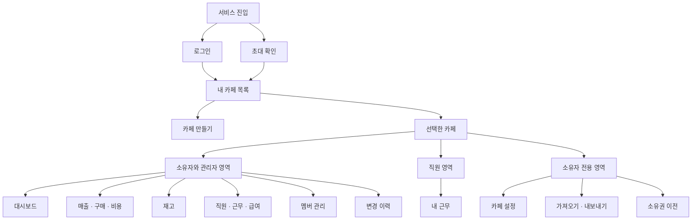

# Cafe Admin 정보 구조 IA

- 버전: 0.1
- 작성일: 2026-10-07
- 상태: MVP 화면 설계안이며 현재 구현된 화면 목록이 아님
- 기준: [PRD](https://github.com/a01094864335-cell/cafe-admin/blob/main/docs/PRD.md), [작업 계획서](https://github.com/a01094864335-cell/cafe-admin/blob/main/docs/WORK_PLAN.md)
- 연결 문서: [사용자 플로우](https://github.com/a01094864335-cell/cafe-admin/blob/main/docs/USER_FLOWS.md)

## 1 정보 구조 원칙

1. 계정 영역과 카페 영역을 분리한다. 로그인 계정 하나가 여러 카페에 참여한다.
2. 장부 화면은 반드시 하나의 카페에 속한다. 모든 카페 화면에 현재 카페명과 내 역할을 표시한다.
3. 권한은 카페별 멤버십에 따라 적용한다. 같은 사용자라도 카페 전환 시 메뉴와 접근 범위가 바뀐다.
4. 직원의 기본 화면은 본인 근무다. 손익과 급여가 포함된 관리 대시보드를 경유하지 않는다.
5. 메뉴 노출과 서버 권한 검증을 함께 적용한다. 숨긴 화면의 URL을 직접 입력해도 접근할 수 없다.
6. 경로와 화면 ID는 구현을 위한 제안이다. 세부 레이아웃이나 프런트엔드 프레임워크는 지정하지 않는다.

## 2 전체 사이트맵

이 그림은 메뉴 계층을 보여준다. 로그인 성공·실패와 역할에 따른 실제 이동 분기는 사용자 플로우 문서에서 정의한다. 변경 이력 화면을 소유자·관리자에게 제공하는 것은 운영 요구사항을 화면으로 구체화한 제안이다.

## 3 공통 화면과 진입 경로

| ID | 화면 | 제안 경로 | 접근 대상 | 주요 정보와 행동 |
| --- | --- | --- | --- | --- |
| G01 | 로그인 | `/login` | 비로그인 사용자 | Google 로그인, 실패 안내, 로그인 후 안전한 원래 경로 복귀 |
| G02 | 내 카페 목록 | `/cafes` | 로그인 사용자 | 참여 카페·내 역할, 카페 선택, 카페 없음 안내 |
| G03 | 카페 만들기 | `/cafes/new` | 파일럿 생성 허용 사용자 | 매장명·시간대 입력, 소유자 멤버십 생성 |
| G04 | 초대 확인 | `/invitations/:token` | 링크 보유자, 수락은 로그인 필요 | 만료·취소·수락 상태, 대상 이메일 확인, 참여 수락 |
| G05 | 계정 메뉴 | 별도 경로 없음 | 로그인 사용자 | 이름·이메일, 내 카페로 이동, 로그아웃 |
| G06 | 접근·세션 오류 | 공통 상태 화면 | 요청한 사용자 | 로그인 필요, 접근 불가, 삭제·이동된 대상, 목록으로 돌아가기 |

카페가 없는 사용자는 빈 목록에서 초대 수락 방법을 확인한다. 생성 권한이 없으면 카페 만들기를 제공하지 않는다. 초대는 링크로 진입하며 초대받지 않은 사용자에게 카페 전체 정보나 멤버 목록을 공개하지 않는다.

## 4 카페별 화면 목록

`/cafes/:cafeId` 진입 시 현재 멤버십을 확인하고 소유자·관리자는 대시보드, 직원은 내 근무로 이동한다. 아래 모든 경로는 해당 카페의 현재 역할을 서버가 다시 검증한다.

| ID | 화면 | 제안 경로 | 소유자 | 관리자 | 직원 | 주요 기능 |
| --- | --- | --- | --- | --- | --- | --- |
| C01 | 대시보드 | `/cafes/:cafeId/dashboard` | 허용 | 허용 | 차단 | 기간별 매출·비용·손익 |
| C02 | 매출 | `/cafes/:cafeId/sales` | 허용 | 허용 | 차단 | 목록·기간 조회·등록·수정·삭제 |
| C03 | 구매 | `/cafes/:cafeId/purchases` | 허용 | 허용 | 차단 | 구매 내역·연결 품목·재고 반영 |
| C04 | 비용 | `/cafes/:cafeId/expenses` | 허용 | 허용 | 차단 | 비용 기록·분류·기간 조회 |
| C05 | 재고 | `/cafes/:cafeId/inventory` | 허용 | 허용 | 차단 | 품목·수량·입출고·조정 이력 |
| C06 | 직원 | `/cafes/:cafeId/employees` | 허용 | 허용 | 차단 | 직원 정보·계정 연결·근무 대상 관리 |
| C07 | 전체 근무 | `/cafes/:cafeId/work` | 허용 | 허용 | 차단 | 직원·기간별 근무 입력·조회·관리 |
| C08 | 급여 | `/cafes/:cafeId/payroll` | 허용 | 허용 | 차단 | 직원별 급여 설정·기존 범위 계산 |
| C09 | 내 근무 | `/cafes/:cafeId/my-work` | 허용 | 허용 | 본인만 | 계정에 연결된 본인 근무 조회·입력 |
| C10 | 멤버 관리 | `/cafes/:cafeId/members` | 전체 관리 | 직원 관리 | 차단 | 초대·역할 변경·참여 해제 |
| C11 | 카페 설정 | `/cafes/:cafeId/settings` | 허용 | 차단 | 차단 | 매장명·시간대·소유권 이전 |
| C12 | 데이터 관리 | `/cafes/:cafeId/data` | 허용 | 차단 | 차단 | 빈 카페 JSON 이전·카페별 내보내기 |
| C13 | 변경 이력 | `/cafes/:cafeId/history` | 허용 | 허용 | 차단 | 작업자·대상·작업 종류·시간 |

- 카페의 직원 정보와 서비스 멤버는 서로 다른 개념이다. 로그인 계정 없는 직원도 급여 대상에 등록할 수 있다.
- 내 근무는 연결된 직원이 없으면 연결 안내를 표시한다. 사용자가 임의 직원 ID로 본인 범위를 바꿀 수 없다.
- 관리자에게 소유자·다른 관리자의 역할 변경이나 참여 해제 행동을 제공하지 않는다.
- 직원의 본인 급여 열람과 장부 입력은 MVP에 포함하지 않는다.
- 직원의 근무 수정·삭제 범위는 PRD가 확정한 조회·입력 범위를 넘어 자동 추가하지 않는다. 정책 변경이 필요하면 PRD와 함께 갱신한다.

## 5 메뉴와 공통 구성

### 소유자와 관리자

- 상단: 현재 카페명, 내 역할, 카페 전환, 계정 메뉴.
- 장부: 대시보드, 매출, 구매, 비용, 재고.
- 인력: 직원, 전체 근무, 급여, 내 근무.
- 관리: 멤버 관리, 변경 이력.
- 소유자 추가 메뉴: 카페 설정, 데이터 관리.

### 직원

- 상단: 현재 카페명, 내 역할, 카페 전환, 계정 메뉴.
- 본문 메뉴: 내 근무.
- 관리용 데이터는 화면에 숨기는 방식으로 내려보내지 않고 API 응답부터 제외한다.

### 모바일

카페 전환을 상단에서 유지하고 메뉴는 접어서 제공한다. 입력·저장 상태와 현재 카페 이름을 작은 화면에서도 확인할 수 있게 한다. 장부 필터와 등록 행동은 해당 목록 가까이에 배치한다.

## 6 화면별 필수 상태

| 화면군 | 빈 상태 | 오류·예외 상태 | 성공 상태 |
| --- | --- | --- | --- |
| 카페 목록 | 참여 카페 없음 | 세션 만료·조회 실패 | 참여 카페와 역할 표시 |
| 장부 목록 | 기록 없음·필터 결과 없음 구분 | 권한 회수·조회 실패 | 현재 카페·기간의 목록 |
| 입력·수정 | 입력 전 | 필드 오류·미저장·충돌·결과 확인 중 | 서버 저장 확인 후 완료 |
| 내 근무 | 근무 없음 | 직원 계정 미연결·접근 불가 | 본인 기록만 표시 |
| 초대 | 수락 대기 | 만료·취소·이미 사용·이메일 불일치 | 멤버십 생성 후 카페 진입 |
| 데이터 이전 | 파일 미선택 | 비어 있지 않은 카페·검증 실패·부분 작업 실패 | 건수·합계 비교 결과 |
| 내보내기 | 빈 장부도 구조를 포함해 내보내기 | 세션 만료·권한 부족·다운로드 실패 | 다운로드 완료 여부 확인 안내 |

서버 응답을 받지 못한 저장은 실패와 성공을 단정하지 않는다. 같은 요청 식별 값으로 결과를 확인하거나 재시도해 중복 생성을 막는다. 미저장 입력은 자동으로 성공 처리하거나 다른 카페에 복사하지 않는다.

## 7 연결과 이동 규칙

- 카페 선택 후 역할에 맞는 기본 화면으로 이동한다. 즐겨찾기·직접 URL도 멤버십을 먼저 확인한다.
- 카페 전환 시 미저장 입력이 있으면 현재 화면 유지 또는 입력 폐기를 선택한다. 전환 완료 후 이전 카페의 캐시·응답을 제거한다.
- 저장 충돌 시 내 입력과 최신 서버 기록을 비교하게 한다. 자동 덮어쓰기를 제공하지 않는다.
- 초대 수락 후 이미 멤버라면 기존 권한을 초대 역할로 덮어쓰지 않고 해당 카페로 안내한다.
- 세션 만료 후에는 로그인으로 이동하되 다른 사용자의 재로그인에 이전 입력을 자동 적용하지 않는다.
- 권한이 회수되면 해당 카페 화면을 비우고 내 카페 목록으로 이동한다.

## 8 구현 작업과 검증 연결

| 화면 | 작업 계획서 | 주요 검증 |
| --- | --- | --- |
| G01·G05·G06 | W05 | 로그인·만료·로그아웃 |
| G02·G03, 카페 공통 | W06 | T01·T02·T09 |
| G04·C10·C11 | W07 | T04·T05 |
| C01–C05 | W08·W09·W11 | T02·T06·T07·T08 |
| C06–C09 | W10 | T03 |
| C12 | W12·W14 | T10·T11 |
| C13 | W13 | 작업자·카페·대상 이력 확인 |
| 모바일·공통 상태 | W15·W16 | T12와 파일럿 사용자 검증 |

이 문서의 경로·메뉴·상태 처리는 구현 제안이다. 역할 변경이나 기능 추가가 발생하면 PRD, 작업 계획서, 사용자 플로우와 함께 수정한다.
