# Cafe Admin 사용자 플로우차트

- 버전: 0.1
- 작성일: 2026-10-07
- 상태: MVP 사용자 흐름 설계안
- 기준: [PRD](https://github.com/a01094864335-cell/cafe-admin/blob/main/docs/PRD.md), [작업 계획서](https://github.com/a01094864335-cell/cafe-admin/blob/main/docs/WORK_PLAN.md)
- 화면 ID: [IA](https://github.com/a01094864335-cell/cafe-admin/blob/main/docs/IA.md)의 G01–G06, C01–C13 사용

Mermaid 코드 블록으로 작성한 흐름이다. 각 그림 아래에 화면, 조건, 예외를 명시한다. 신규 화면과 분기는 설계 제안이며 실제 구현 여부는 작업 계획서에서 추적한다.

## F01 로그인과 최초 진입

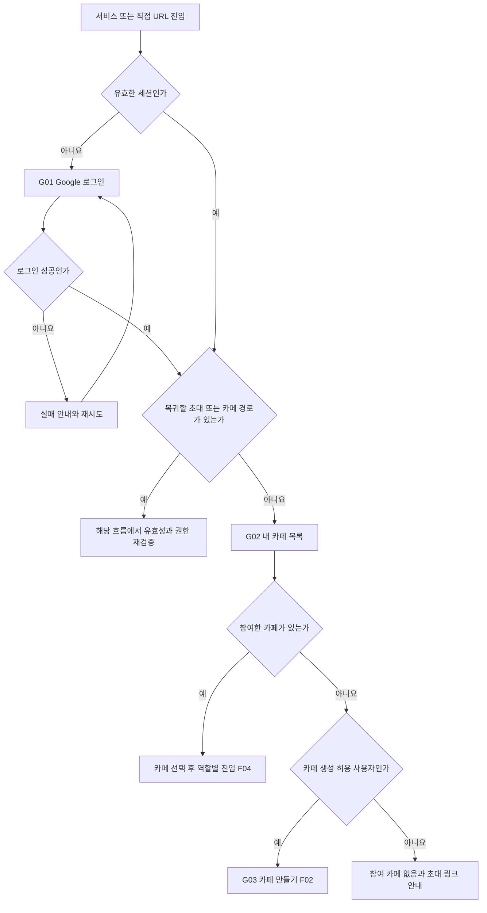

- 연결 작업: W05–W06. 복귀 경로는 서비스 내부의 허용된 경로로 제한한다.
- 초대 링크를 통한 로그인은 F03으로 돌아가고, 카페 직접 URL은 F04의 멤버십 검증을 거친다.
- 로그인 실패는 빈 카페나 신규 계정 생성 성공으로 처리하지 않는다.

## F02 카페 생성

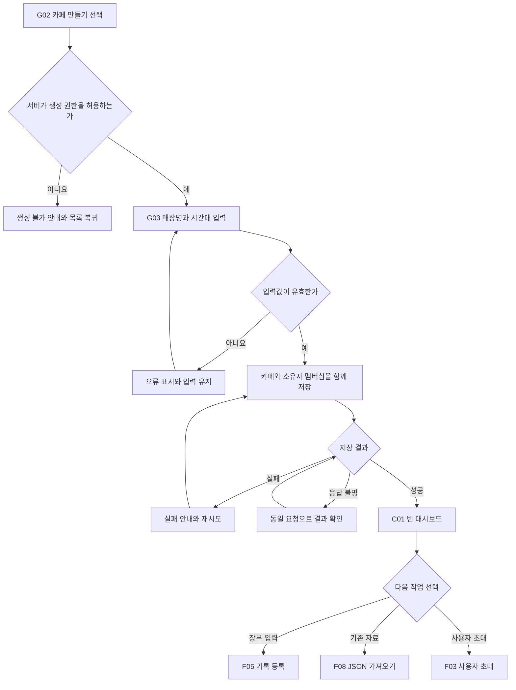

- 연결 작업: W06. 생성 재시도로 카페가 중복 생성되지 않게 요청을 식별한다.
- 생성과 소유자 연결은 함께 성공해야 한다. 소유자 없는 카페를 사용자에게 노출하지 않는다.

## F03 초대 생성과 수락

### 초대하는 사용자

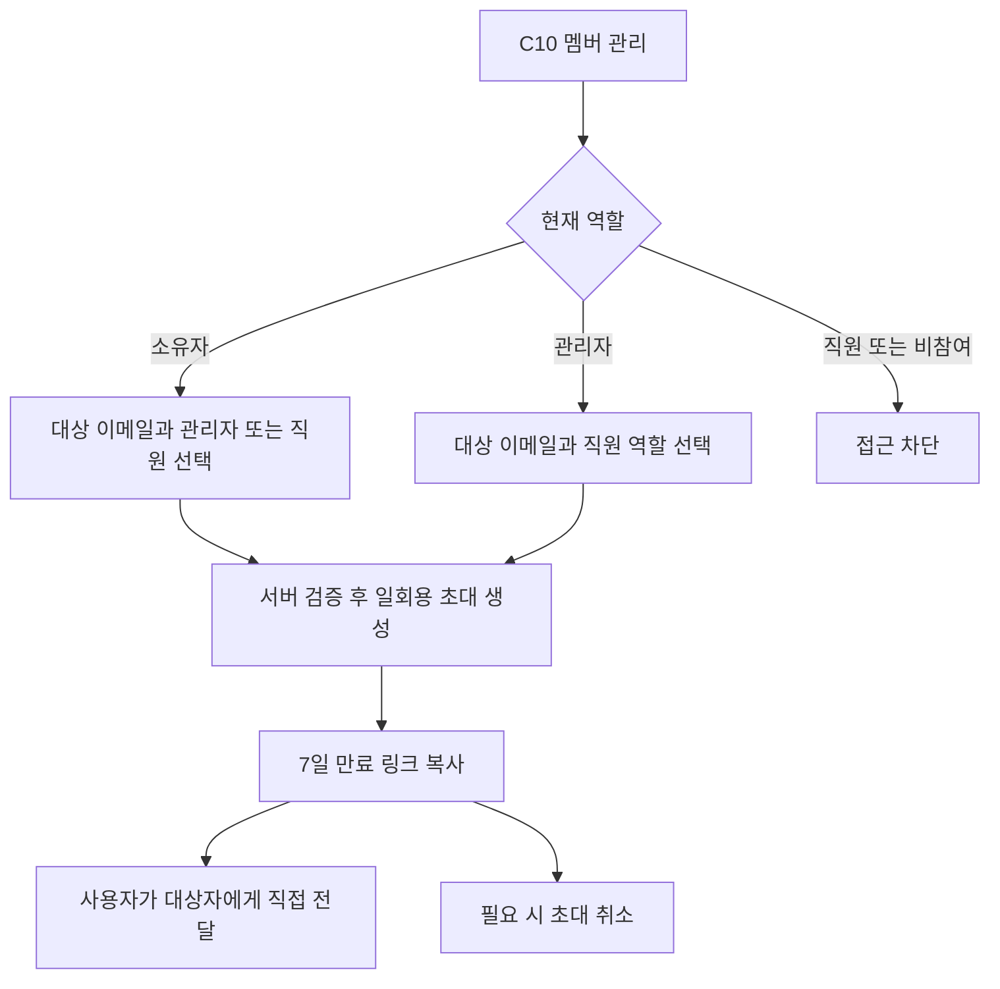

### 초대받은 사용자

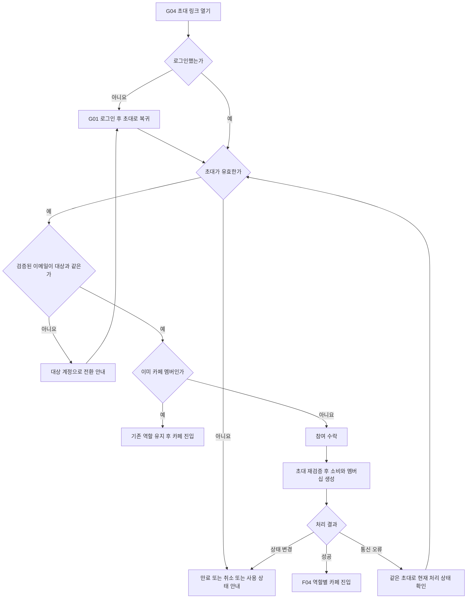

- 연결 작업: W07, 검증 T04. 서버가 수락 직전에 초대 상태·대상 이메일·역할 부여 권한을 다시 검증한다.
- 동시 수락은 멤버십 중복을 만들지 않는다. 첫 수락 성공 후 응답만 유실된 경우에는 기존 참여 사실을 확인해 카페 진입을 안내한다.
- 초대 생성자의 권한이 회수되면 남은 초대의 수락도 차단하는 것을 기본 설계로 한다.
- 자동 이메일 발송은 MVP에 포함하지 않는다.

## F04 카페 진입과 전환

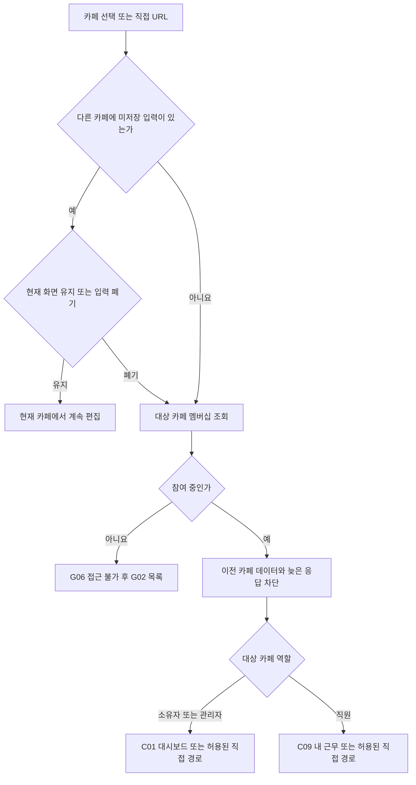

- 연결 작업: W06, 검증 T01·T02·T09. 역할에 맞지 않는 직접 경로는 접근 불가 안내 후 해당 역할의 기본 화면으로 이동한다.
- 전환 시 현재 카페명·내 역할·메뉴를 함께 갱신한다. 기록 ID가 존재하더라도 다른 카페 소속이면 접근을 허용하지 않는다.

## F05 장부 등록과 저장 결과 확인

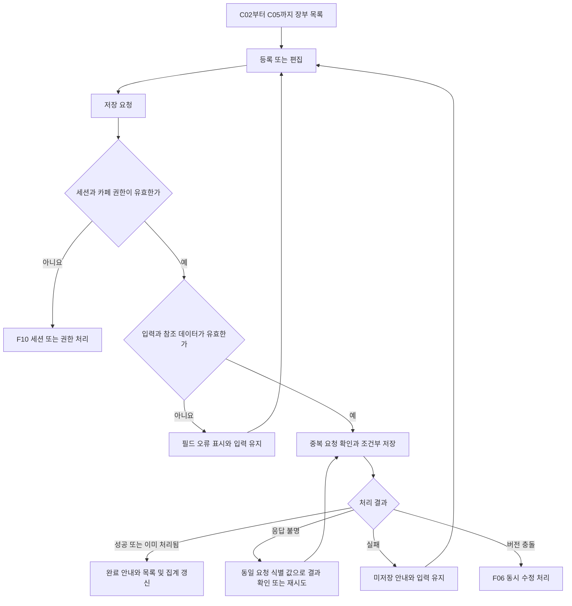

- 연결 작업: W08·W09·W11, 검증 T06·T07·T08. 재시도 시에도 세션과 권한을 다시 확인한다.
- 구매와 재고 이동 등 연결 작업은 함께 성공하거나 실패해야 한다. 삭제도 서버 권한·버전 검증을 거친다.
- 직원은 이 흐름에 접근할 수 없다. 내 근무 입력은 F07을 따른다.

## F06 동시 수정 충돌

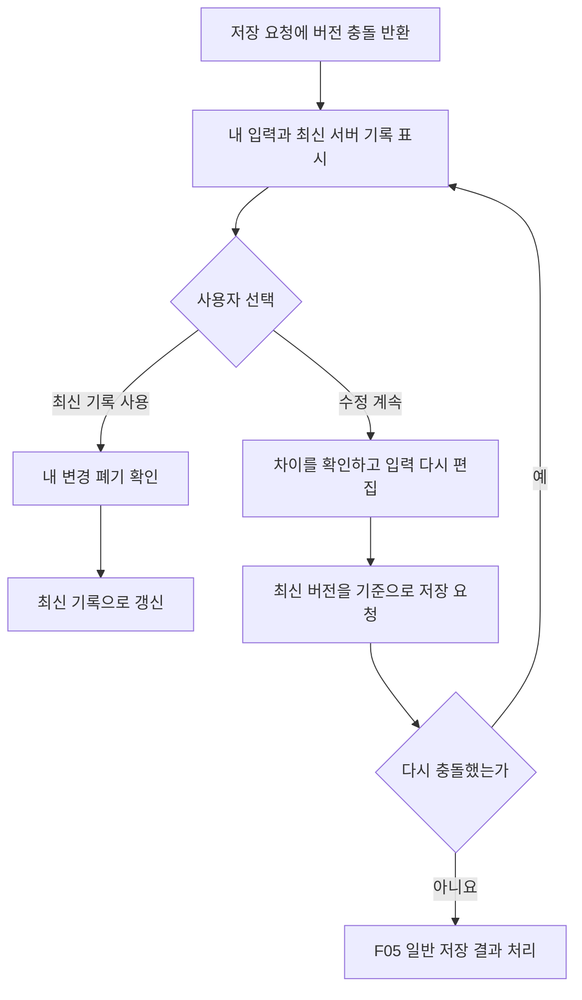

- 연결 작업: W11, 검증 T06. 최신 버전으로 저장해도 충돌 검사를 생략하지 않는다.
- 서버에서 기록이 삭제되었거나 접근 권한이 사라졌다면 재편집 저장을 막고 목록으로 안내한다.
- 자동 병합·강제 덮어쓰기는 MVP에 포함하지 않는다.

## F07 직원의 본인 근무 입력

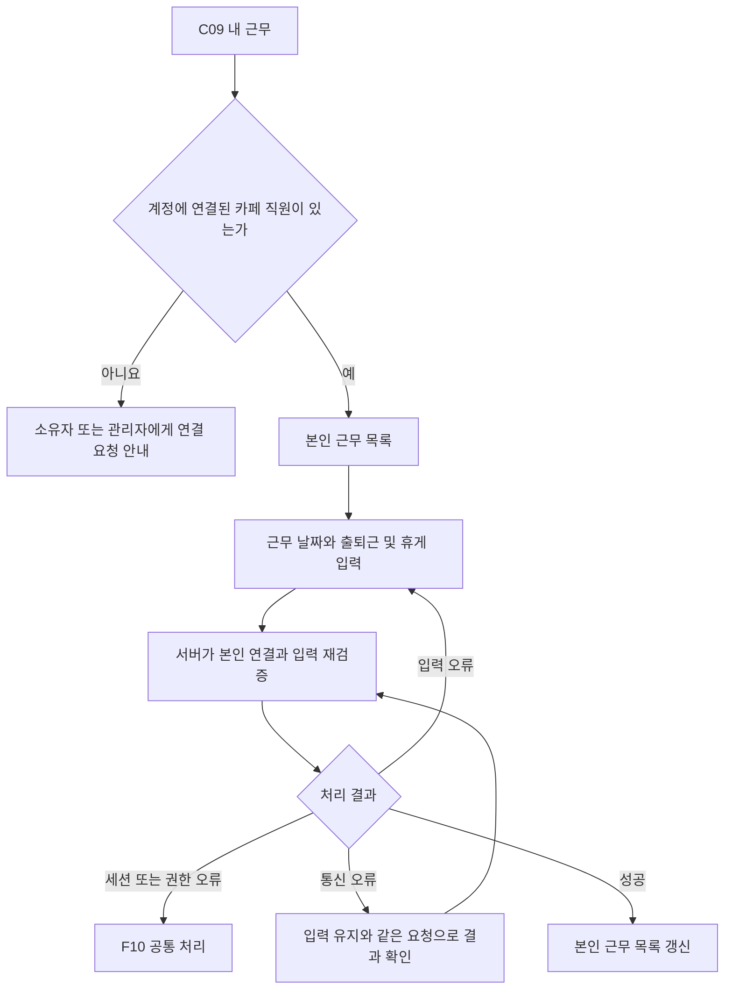

- 연결 작업: W10, 검증 T03. 본인 직원 연결은 서버가 결정하며 클라이언트가 임의로 바꾸지 못한다.
- 계정 미연결은 장부 데이터가 없는 상태와 구분한다. 직원에게 급여·전체 근무를 응답하지 않는다.

## F08 기존 JSON 가져오기와 백업

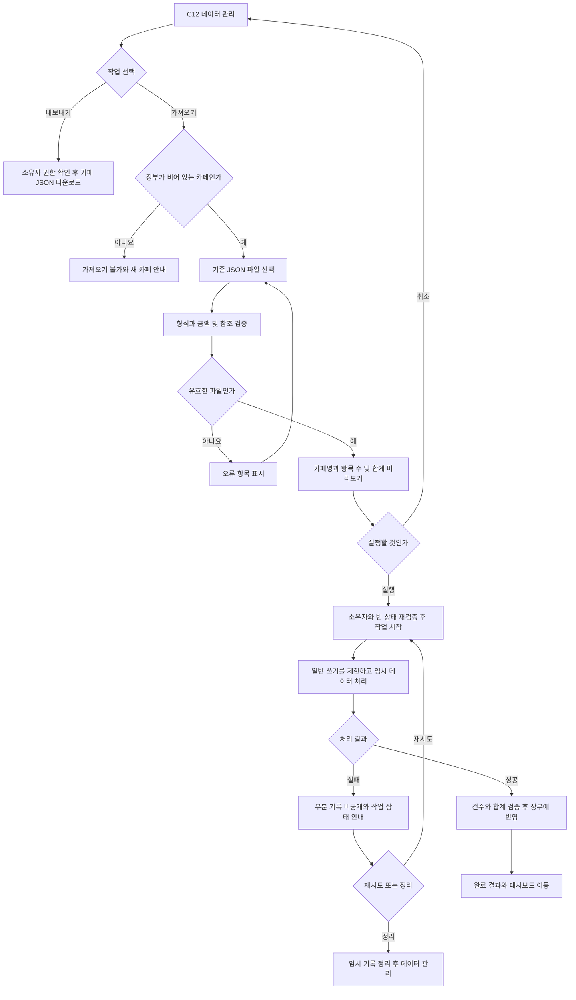

- 연결 작업: W12·W14, 검증 T10·T11. 진행 중 새로고침하면 새 작업을 만들지 않고 기존 작업 상태를 조회한다.
- 재시도 시 기존 임시 작업을 식별해 중복 반영을 막는다. 일반 장부와 집계에는 완료된 데이터만 노출한다.
- 가져오기·내보내기는 소유자 전용이며 관리자·직원은 접근할 수 없다. 다운로드 요청과 실제 파일 확보를 구분해 안내한다.

## F09 역할 변경과 소유권 이전

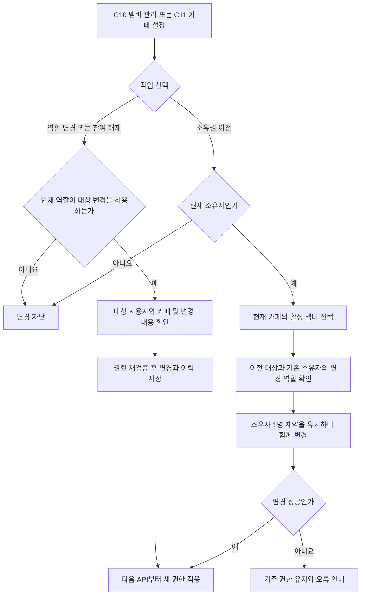

- 연결 작업: W07, 검증 T05. 관리자에게 소유자·다른 관리자 변경을 허용하지 않는다.
- 소유권 이전 후 기존 소유자는 관리자로 전환하는 것을 제안한다. 구현 전에 W02에서 이 정책을 확정하고 PRD에 반영한다.
- 소유자는 이전 없이 탈퇴할 수 없다. 참여 해제는 과거 거래·근무 기록 삭제를 의미하지 않는다.

## F10 세션 만료와 권한 회수

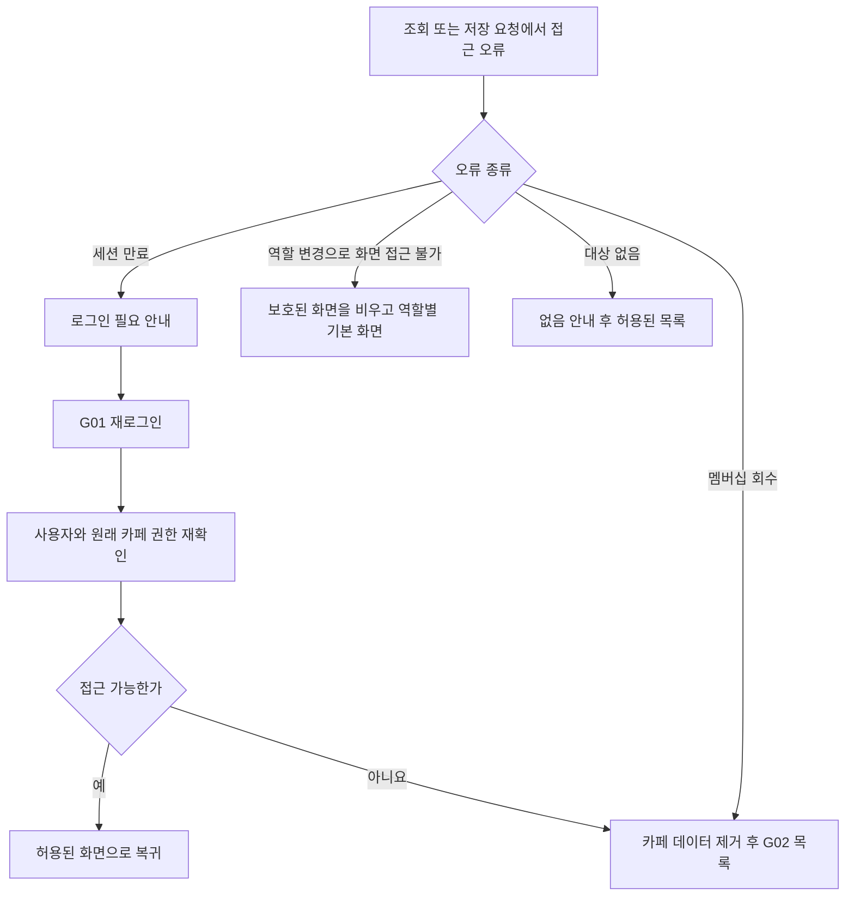

- 연결 작업: W05–W07. 재로그인 후 저장을 자동 재실행하지 않는다. 동일 사용자·카페인지 확인하고 사용자 확인을 거쳐 재시도한다.
- 사용자나 카페가 달라졌다면 이전 장부 입력을 자동 복원하지 않는다. 권한이 사라진 데이터는 화면과 캐시에 남기지 않는다.

## 화면과 흐름 연결표

| 흐름 | 주요 화면 | 작업 | 검증 |
| --- | --- | --- | --- |
| F01 로그인 | G01·G02·G06 | W05–W06 | 세션·로그인·안전한 복귀 |
| F02 생성 | G03·C01 | W06 | 카페와 소유자 함께 생성 |
| F03 초대 | G04·C10 | W07 | T04 |
| F04 전환 | G02·C01·C09 | W06 | T01·T02·T09 |
| F05 저장 | C02–C05 | W08·W09·W11 | T06·T07·T08 |
| F06 충돌 | C02–C05 편집 상태 | W11 | T06 |
| F07 내 근무 | C09 | W10 | T03 |
| F08 자료 이전 | C12 | W12·W14 | T10·T11 |
| F09 역할 관리 | C10·C11 | W07 | T05 |
| F10 접근 오류 | G01·G02·G06·카페 공통 | W05–W07 | T02·T05 |

PRD의 제품 범위를 바꾸는 신규 정책은 확정 사항처럼 구현하지 않는다. IA와 이 문서가 제안하는 세부 정책을 W02에서 정리한 뒤 관련 문서를 함께 갱신한다.
